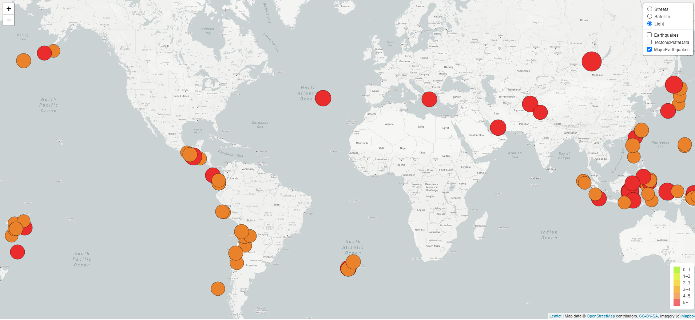
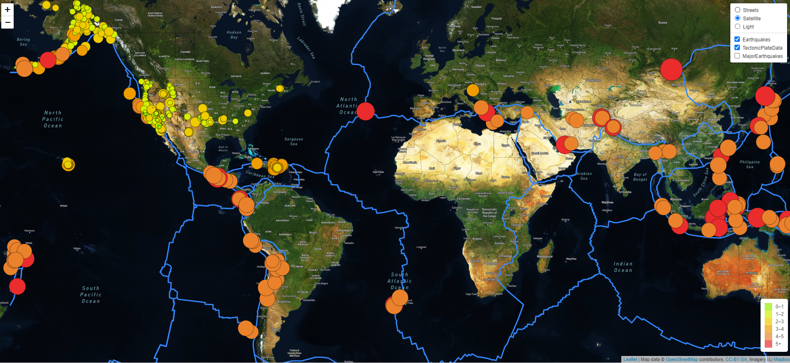
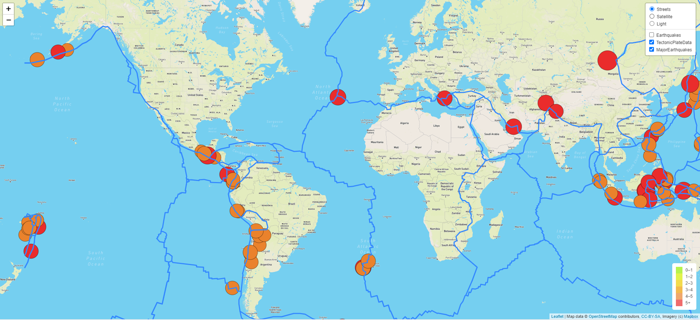

# Mapping_Earthquakes

Basil and Sadhana have asked that I create an interactive earthquake map with different map layers and earthquake data overlays. This data will be overlaid across the tectonic plate lines around the globe. With an extra layer of information the lighter earthquakes will be filtered out
and the major earthquakes will be the visible ones. For this project I used Leaflet javascript and Mapbox API information. I also used the USGS collection of the most recent earthquakes recorded in the last week. 

## Earthquake Maps 
* Light Map with Major Earthquakes *

* Satellite View with Tectonic Plate Lines and All Earthquakes *

* Street View with Tectonic Plate Lines and only Major Earthquakes *
